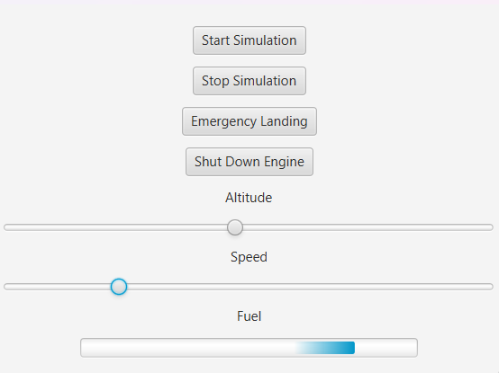

**Flight Dashboard**

A JavaFX-based flight data dashboard simulation project. The application visually displays live-updating flight data (altitude, speed, and fuel level) and provides control buttons for simulation control and emergency actions.

**Features**

Real-time simulated flight data generation

UI updates every second using JavaFX controls

Singleton-based FlightDataRepository for centralized data access

Console logger listener for debugging

Start/Stop Simulation

Emergency Landing & Shut Down Engine actions

**Technologies Used**

Java 17+

JavaFX

Scene Builder (for UI design)

Maven or IntelliJ IDEA for build & run

MVC architecture pattern

**How to Run**
Clone this repository:
git clone https://github.com/seydagultopal/flight-dashboard.git

Open the project in IntelliJ IDEA (with JavaFX configured).

Make sure your JavaFX SDK is properly linked in:
File → Project Structure → Libraries

**Run** 

Main.java

**Note:** 

JavaFX VM options may be required:
--module-path /path/to/javafx-sdk/lib --add-modules javafx.controls,javafx.fxml

Screenshots

Author
Developed by Şeyda Gül Topal for educational purposes.

